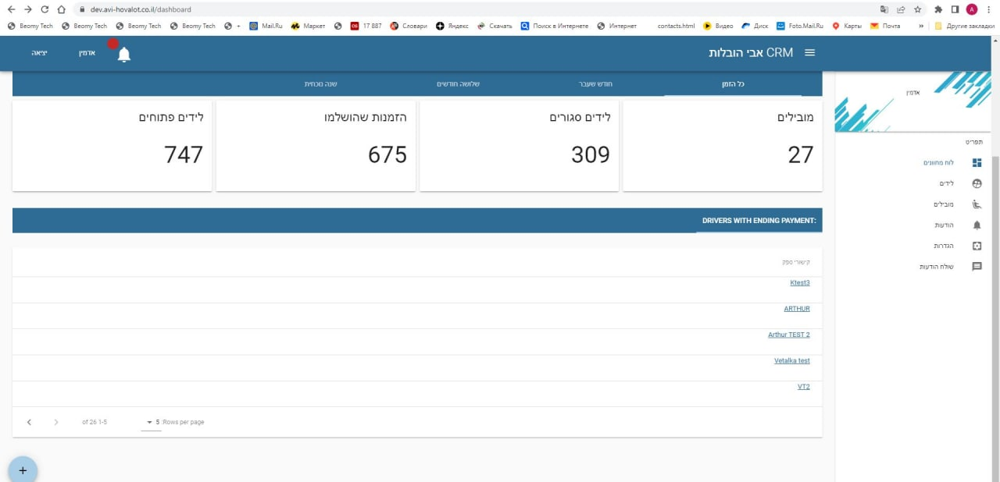
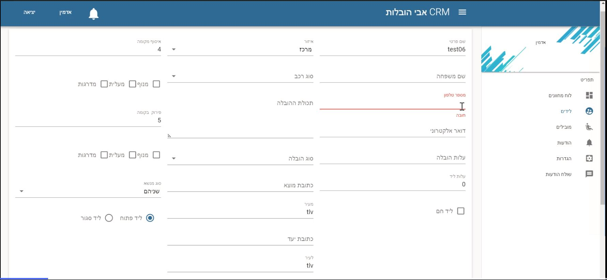

Пример фрагмента проекта CRM-системы для перевозчиков, предоставляющих услуги грузоперевозок и специального транспорта, а также для их клиентов.

В папке frontend/src/views находятся vue-шаблоны:

Dashboard/Dashboard.vue - для главной страницы:

Leads/LeadsCreate.vue - для страницы создания лида (заявки на перевозку/оказания специальных работ):

